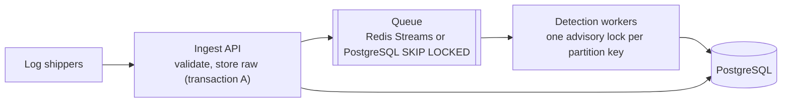

# Future architecture

Where SentinelX would go next, and **what would trigger each step**. None of this is built.
The current design is deliberately the simplest one that does the job
([ADR-0001](decisions/0001-modular-monolith.md), [ADR-0008](decisions/0008-synchronous-bounded-pipeline.md)).
Each step below is taken only when a measurement says the current design no longer holds.
What exists today: [architecture.md](architecture.md). What it cannot do:
[limitations.md](limitations.md).

## Principles that make the steps possible

Decisions already in the code that keep these changes local:
- **Module boundaries.** Ingestion hands the rest of the system only `NormalizedEvent`
  objects. Detection consumes events and returns detections. Correlation consumes alerts.
  Each could become its own process without changing the others' logic.
- **Stateless, idempotent detection.** Every run re-reads its windows from the database and
  relies on unique evidence links and deduplication keys. A run can be retried or moved to a
  worker without losing or duplicating alerts.
- **Pure cores.** Parsers, conditions, evaluators, correlation scoring, risk and the demo
  generators take their inputs (including `now`) as parameters, so they run the same in a
  request, a worker or a test.
- **Raw records are kept as exact bytes.** A new or fixed parser can re-process old evidence.

## Step 1: ingestion through a queue

**Trigger:** senders wait too long for their batch to be detected, or bursts are refused
(413/429) more often than sources can retry.

- The API keeps transaction A (store raw records and events, commit) and returns at once
  with the batch in state STORED. That state and the reconciler already exist: a crash
  between the two transactions is handled today (`reconcile-batches`).
- Workers take batches and run transaction B (detection, alerts, correlation).
- **Cost:** a queue to operate, and "eventually detected" instead of "detected when the
  request returns". The batch report becomes a status to poll.

## Step 2: parallel detection

**Trigger:** one detection pass at a time (the advisory lock) becomes the bottleneck with
many concurrent senders. The benchmark sent one batch at a time, so it does not measure this;
a concurrent benchmark comes first.

- Partition the lock by what rules group on (host, or account). Two batches about different
  hosts can then run at once. Rules that group across hosts (AUTH-005, password spraying)
  keep a global lock or run as a separate periodic pass.
- **Cost:** reasoning about which rules may run concurrently. The real-concurrency tests
  (`test_alert_concurrency.py`, `test_incident_concurrency.py`) are where that is proven.

## Step 3: storage growth

**Trigger:** the events table outgrows the disk budget, or a query in
[performance.md](performance.md) leaves its measured range.

- Partition `events` and `raw_events` by month. The keyset pagination already orders by
  `(timestamp, id)`, which would become the primary key.
- A retention job drops old partitions, holding back any referenced by open incidents. It is
  a deliberate operator action, separate from the append-only triggers.
- Daily summaries (migration 0014) already keep the dashboard independent of table size. They
  are written only by triggers, so a retention job must adjust them in the same step.
- Read replicas for hunting and dashboards, if hunts start competing with ingestion.

## Step 4: a search engine for hunting

**Trigger:** analysts need full-text relevance, aggregations over arbitrary fields, or hunts
longer than 31 days ([threat-hunting.md](threat-hunting.md#limits-honest)).

- Index normalized events into OpenSearch from the same transaction outcome (an outbox
  table, so the index never has events the database lacks).
- PostgreSQL stays the system of record and the place detection reads from. The search
  engine serves hunting only.
- **Cost:** a second datastore to operate, secure and keep consistent. That is why it is not
  built for the volumes SentinelX handles today.

## Step 5: more sources

How real sources connect without changing detection or correlation:

| Source | Path in | New code |
|---|---|---|
| Linux hosts | rsyslog `omhttp`, Vector or Fluent Bit posting auth.log lines to `/api/ingest/{source}` with the source's ingest key | None (parser exists) |
| auditd / execve | Same shippers | A parser; process rules gain visibility into commands run without sudo |
| Windows | Windows Event Forwarding → collector → Winlogbeat or NXLog JSON | A mapping for that JSON shape, if it differs from the accepted one |
| Cloud audit logs (CloudTrail, Azure Activity, GCP Audit) | A pull worker or a shipper | A parser per provider and cloud-specific rules |
| Identity providers (Entra ID, Okta sign-in logs) | API pull | A parser to the `authentication` category; AUTH rules apply as they are |
| EDR / endpoint telemetry | Vendor export as JSON | A parser to `process` and `network` events; PROC and NET rules apply |

Each source needs a parser, fixtures (including malformed input) and tests. The parsers'
linear-time test and the per-source ingest keys and host allowlists already apply.

## Step 6: more detection and response

- **Cross-host correlation (lateral movement)**, once sources carry session linkage (Windows
  logon IDs across 4624/4648, Kerberos ticket events). It was deferred for lack of that
  evidence ([ADR-0013](decisions/0013-advanced-detection-engineering.md)).
- **Sigma rules** translated into the YAML format, with the same review and the same safe
  condition language (no regular expressions supplied by users).
- **Notifications** (mail, chat, webhooks) on new high-priority incidents, sent from an
  outbox so a delivery failure never blocks detection.
- **Response actions** stay recommendations: SentinelX is defensive and does not change
  other systems. An integration would hand a reviewed action to the tool that owns it (a
  ticket, an EDR isolation request) with the analyst's approval, audited.

## Step 7: high availability

**Trigger:** the deployment must survive a host failure without a restore.

- A managed PostgreSQL (or a replica with failover), and two or more backend instances behind
  the proxy. The rate limits already live in PostgreSQL and hold across instances (Phase 13).
- Detection needs the queue of step 1 first, so only workers take the detection lock.
- Kubernetes becomes worth its cost at this step, and not before
  ([ADR-0014](decisions/0014-single-host-compose-deployment.md)).
